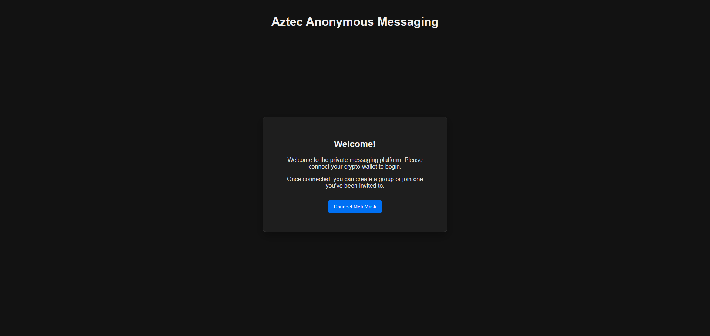
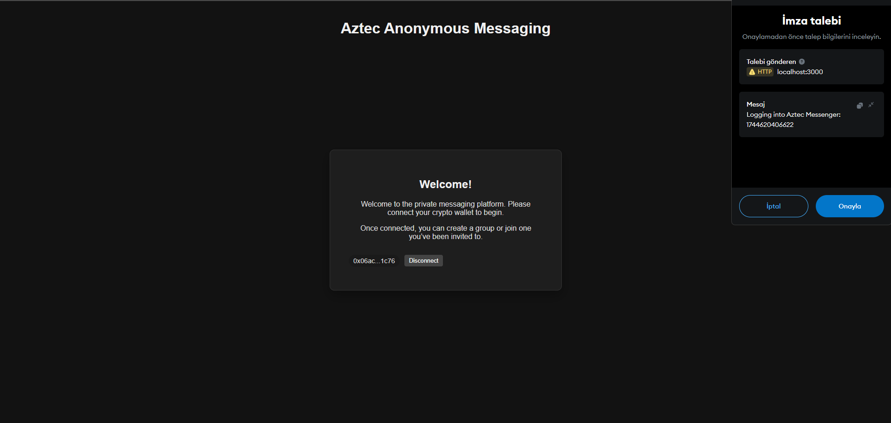
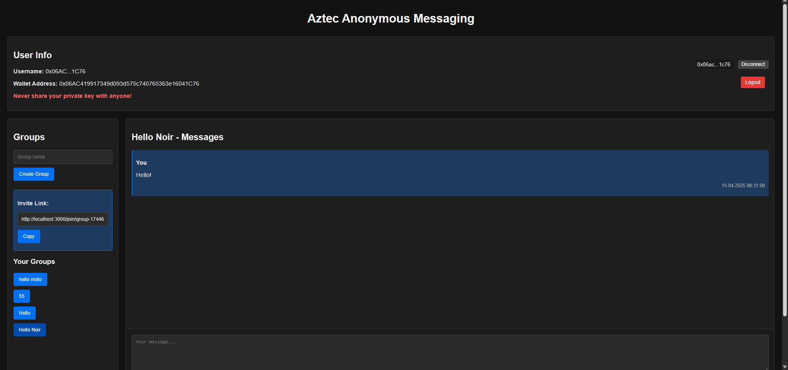
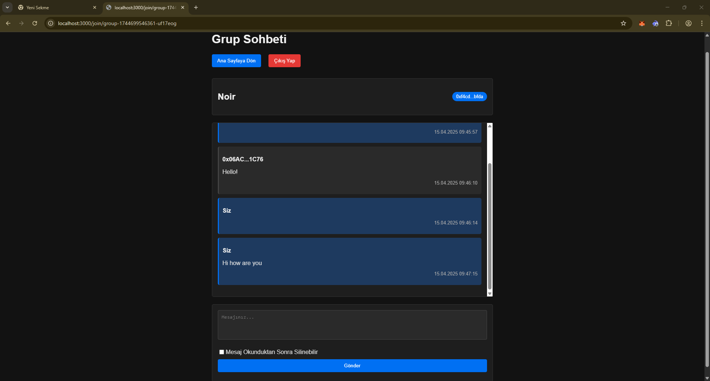
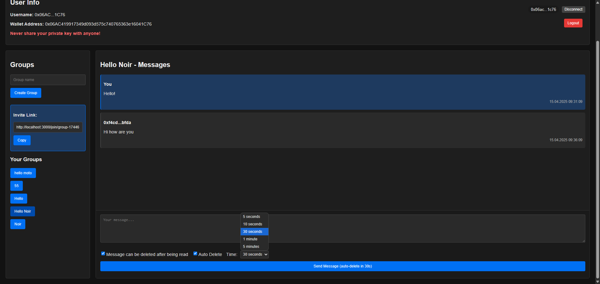

# Aztec Anonymous Messenger

A Zero-Knowledge (ZK) powered anonymous messaging app built using **Noir** and **Aztec SDK**. This project allows users to communicate privately and securely through ephemeral group chats that leverage privacy-preserving smart contracts on the Aztec network.

---

🌐 Project Website
In an age where privacy is no longer a luxury, but a necessity, we believe that clarity of vision is just as essential as strong encryption.

To help you understand why this project exists, who is building it, and where it’s headed, we’ve created a dedicated information website:

👉 www.aztecanonymousmessenger.com

## 🔎 Features

- 📁 Fully private chats using ZK cryptography
- 📅 Temporary identity with nickname support
- 🚫 No real account or identity required
- 🔗 Invite links for group sharing
- 🔧 Built using Aztec's PXE client and Noir smart contracts
- ⚙ Noir smart contracts + JavaScript SDK integrations.

---

## 📂 Project Structure

```
aztec-messenger/
├── aztec-private-messenger/       # Frontend and backend integration
│   ├── contracts/                 # Noir contract artifact files (.json/.wasm)
│   ├── data/                      # Message storage and in-memory state
│   ├── server.js                 # PXE + Contract deploy + Backend logic
│   └── pages/                    # Next.js frontend pages
└── src/
    └── main.nr                   # Noir contract source and build
```

---

## ⚡ Quick Start (Local)

1. **Install dependencies:**

```bash
npm install
```

2. **Run the backend server:**

```bash
npm run start
```

3. **Run the frontend:**

```bash
npm run dev
```

> Make sure your Noir contract is compiled and the `.json` and `.wasm` files are present under `/contracts/`.

---

## 📚 Noir Smart Contract
This project includes a custom Noir smart contract designed to handle private message creation and submission on the Aztec Network.

The contract defines a `sendMessage` function, which is invoked within a private context to commit encrypted messages to the network without revealing any metadata.

All logic is built using [Aztec’s Noir DSL](https://noir-lang.org/) and compiled with `nargo`. The resulting artifacts are integrated directly into the frontend.

> Messages are not just encrypted — they are shielded on-chain, zero-knowledge validated, and user-agnostic by design.

To explore or modify the contract, visit:

`/contracts/message_contract/src/main.nr`
[📁 View the source on GitHub](/src/main.nr)

## Deployed Contract

**Network:** Aztec Testnet  
**Contract Address:** `0x270f4eccd3e6a4082d51a2010c7adde967df0dc89b480bfbe65ed01ec6f2e921`  
**ABI:** [View ABI](https://github.com/PQEST01/aztec-anonymous-messenger/blob/main/src/counter-PrivateMessenger.json)  

## 🔧 Tech Stack

- **Smart Contracts:** Noir
- **Network:** Aztec Testnet
- **Toolchain:** Nargo, Aztec CLI
- **Zero-Knowledge Proofs:** ZK-SNARKs via Aztec Protocol

## ⚡ Status
This project is **actively maintained** and improved in small but steady iterations.  
Our focus is on demonstrating **real-world private messaging on Aztec testnet**. 

---

## 📢 Screenshots

### Homepage


### Group Chat Interface




---

## 👤 About the Developer

- **GitHub:** [PQEST01](https://github.com/PQEST01)
- **Discord:** pqest

---

## 🤝 Contributing
This project is open to collaboration.  
If you are interested in ZK applications, Noir contracts, or Aztec integrations, feel free to fork, report issues, and suggest improvements.  

## ✉ Feedback

Feel free to open issues or pull requests. You can also reach out to me on [Discord](https://discord.gg/aztec)!

---


